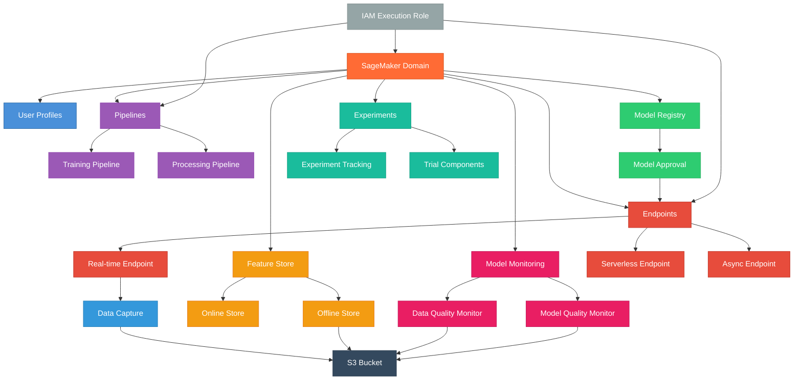

# terraform-aws-sagemaker-mlops

Terraform module for deploying a comprehensive AWS SageMaker MLOps platform with model registry, pipelines, endpoints, feature store, experiments, and model monitoring.

## Architecture



## Features

- **SageMaker Domain** - Managed Studio environment with IAM/SSO authentication
- **User Profiles** - Multi-user support with per-user execution roles
- **Model Registry** - Model package groups for versioning and approval workflows
- **Pipelines** - ML pipeline orchestration with inline or S3-based definitions
- **Endpoints** - Real-time, serverless, and async inference endpoints
- **Feature Store** - Online and offline feature storage
- **Experiments** - Experiment tracking and trial components
- **Model Monitoring** - Data quality and model quality monitoring schedules
- **IAM** - Auto-provisioned execution roles with least-privilege policies

## Usage

```hcl
module "sagemaker_mlops" {
  source = "path/to/terraform-aws-sagemaker-mlops"

  name       = "my-ml-project"
  vpc_id     = "vpc-0123456789abcdef0"
  subnet_ids = ["subnet-abc", "subnet-def"]

  user_profiles = {
    data-scientist = {}
  }

  endpoints = {
    inference = {
      type       = "realtime"
      model_name = "my-model"
    }
  }

  tags = {
    Environment = "dev"
  }
}
```

## Examples

- [Basic](examples/basic/) - Domain with user profile and model registry
- [Advanced](examples/advanced/) - Endpoints, feature store, and experiments
- [Complete](examples/complete/) - Full MLOps platform with monitoring

## Requirements

| Name      | Version  |
|-----------|----------|
| terraform | >= 1.5.0 |
| aws       | >= 5.0   |

## License

MIT License - see [LICENSE](LICENSE) for details.
